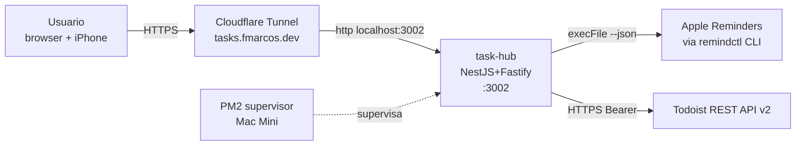

# Diagramas de Componentes (Flowcharts)

Propósito: mapa estable del sistema task-hub. Actualizar solo si cambia topología.

## Contexto (alto nivel)



## Componentes principales (interno)

```mermaid
flowchart TB
    subgraph "task-hub (NestJS)"
        Controller[TasksController<br/>GET /tasks · /tasks/refresh]
        Service[TasksService]
        Cache[TasksCacheService<br/>in-memory + dedup]
        Scheduler[TasksRefreshScheduler<br/>@Interval CACHE_TTL_SECONDS]
        RemSrc[RemindersSource<br/>implements TaskSource]
        TodSrc[TodoistSource<br/>implements TaskSource]
        TodClient[TodoistClient<br/>fetch + AbortController]
        Runner[remindctl runner<br/>execFile + JSON.parse]
        Health[HealthController]
    end

    Controller --> Service
    Service --> Cache
    Scheduler --> Cache
    Cache --> RemSrc
    Cache --> TodSrc
    RemSrc --> Runner
    TodSrc --> TodClient
    Health --> Cache
```
