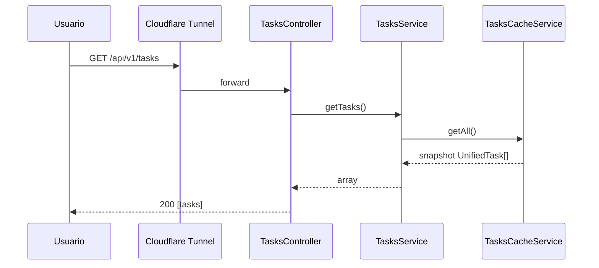
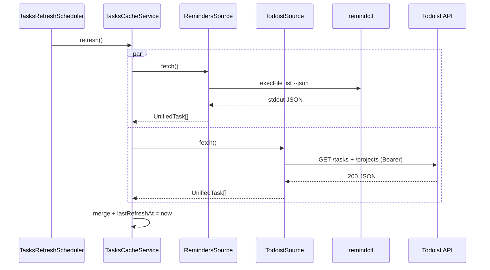
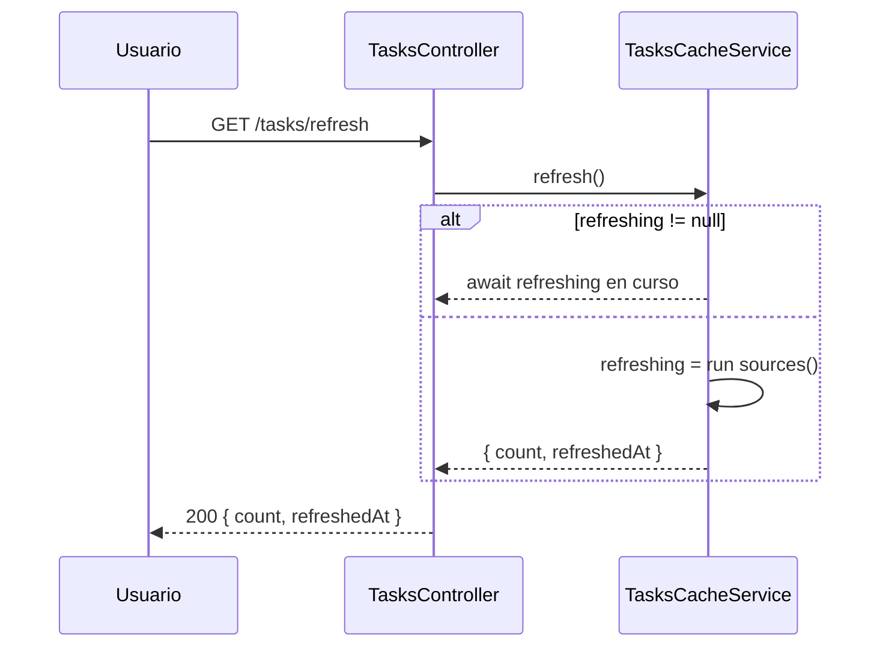

# Diagramas de Secuencia

Propósito: contratos críticos de interacción. Actualizar solo si cambia el flujo.

## GET /tasks (cache hit)



## Refresh periódico (cada CACHE_TTL_SECONDS)



## POST/GET /tasks/refresh (manual) con deduplicación



## Degradación grácil — fuente caída

```mermaid
sequenceDiagram
    participant Cache as TasksCacheService
    participant Rem as RemindersSource
    participant Tod as TodoistSource
    participant Log as Pino Logger

    Cache->>Rem: fetch()
    Rem--xCache: throw RemindctlError
    Cache->>Log: error("reminders source failed", err)
    Cache->>Tod: fetch()
    Tod-->>Cache: UnifiedTask[] (todoist only)
    Note over Cache: result = todoist tasks; cache mantiene snapshot anterior si todo falla
```
